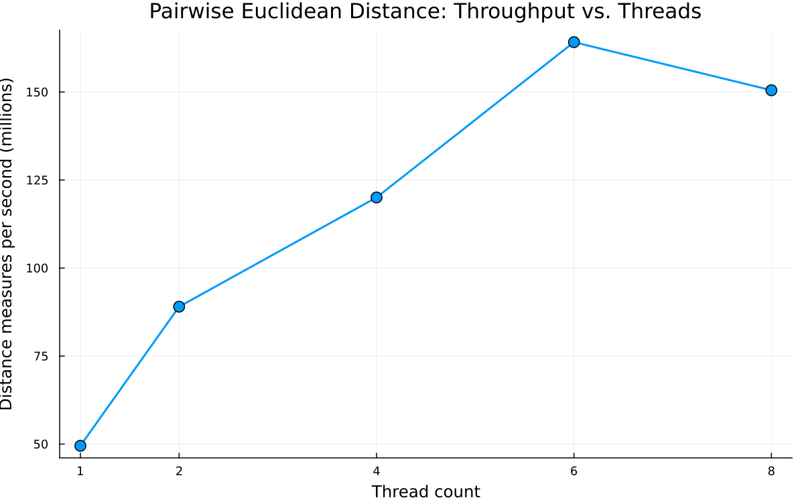
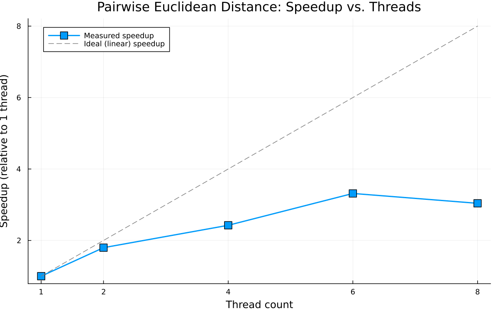

# Parallel Processing Improvements in Julia Jet Reconstruction

## GSoC 2026 Evaluation Exercise

This repository contains the evaluation exercise for candidates interested in the HSF/CERN GSoC project [*Parallel Processing Improvements in Julia Jet Reconstruction*](https://hepsoftwarefoundation.org/gsoc/2026/proposal_JuliaHEP_JetReconstruction.html).

## How to Reproduce the Results

### Prerequisites

- **Julia 1.10+** (tested with Julia 1.12.5)
- Julia packages: `BenchmarkTools`, `Plots` (installed automatically if missing)

### Install Julia

```bash
# On Windows (via winget):
winget install Julialang.Julia

# On macOS (via Homebrew):
brew install julia

# On Linux:
# Download from https://julialang.org/downloads/
```

### Install required packages

```julia
using Pkg
Pkg.add("BenchmarkTools")
Pkg.add("Plots")
```

### Run the benchmarks

```bash
# Run the serial benchmark only:
julia benchmark-serial.jl

# Run the full parallel benchmark sweep (1, 2, 4, 6, 8 threads):
julia run-benchmarks.jl
```

The full benchmark suite launches separate Julia processes with different
thread counts and produces two plots:

- `benchmark_results.png` - throughput vs. thread count
- `speedup_results.png` - speedup vs. thread count (with ideal linear reference)

To run the parallel version directly with a specific thread count:

```bash
julia -t 4 parallel-euclid.jl
```

### File Overview

| File | Description |
|------|-------------|
| `serial-euclid.jl` | Original serial implementation |
| `benchmark-serial.jl` | Serial benchmarking script using BenchmarkTools |
| `parallel-euclid.jl` | Optimised serial + threaded parallel implementations |
| `benchmark-worker.jl` | Worker script invoked by `run-benchmarks.jl` per thread count |
| `run-benchmarks.jl` | Main benchmark driver; sweeps thread counts and generates plots |

---

## 1. Benchmarking the Serial Version

### Methodology

I used Julia's `BenchmarkTools.jl` package, which is the standard tool for
micro-benchmarking in Julia.

**Key aspects of the approach:**

- **Warm-up and JIT compilation**: Julia uses a just-in-time (JIT) compiler. The
  first call to any function compiles it to native machine code, which can take
  orders of magnitude longer than subsequent calls. `BenchmarkTools` handles this
  automatically: `@benchmark` runs the function several times before recording
  measurements. In my script I also perform an explicit warm-up on a smaller
  input (`100x3`) to ensure the function is compiled before the benchmark begins.

- **Multiple samples**: `@benchmark` collects multiple samples (I used 5 samples
  with 1 evaluation each, since each run takes ~2-3 seconds). Statistical
  aggregation (median, min, max) provides a robust measurement that is less
  affected by OS scheduling noise or background processes.

- **Interpolation (`$`)**: The `$points` syntax in `@benchmark` interpolates the
  variable into the benchmark expression, avoiding the overhead of global
  variable access through the Julia runtime, which would add spurious overhead.

- **Reporting the median**: The median time is preferred over the mean because it
  is robust to occasional outlier samples caused by OS interrupts, garbage
  collection pauses, or context switches.

### Serial Results

With N = 10,000 points (100 million distance calculations):

| Metric | Value |
|--------|-------|
| Median time | ~2.0 s |
| Distance measures/s | ~4.95 x 10^7 |
| Memory allocation | 381 MiB (the 10000x10000 Float32 matrix) |
| GC time | < 1% |

### Efficiency Analysis and Improvement Opportunities

The original `serial-euclid.jl` has several inefficiencies:

1. **Redundant computation**: The distance matrix is symmetric
   (`d(i,j) = d(j,i)`) and the diagonal is zero. The original code computes all
   N^2 entries, but only N*(N-1)/2 unique values exist. Computing only the upper
   triangle would halve the work.

2. **Missing `@inbounds`**: Every array access in the inner loop performs bounds
   checking. Adding `@inbounds` eliminates this overhead, which is significant
   in tight loops.

3. **Repeated array indexing**: In the inner loop, `points[i, 1]`, `points[i, 2]`,
   `points[i, 3]` are re-read for every value of `j`. Hoisting these into local
   variables before the inner loop avoids redundant memory loads.

4. **Memory layout (column-major)**: Julia uses column-major array storage. The
   input `points` array is `Nx3`, so iterating over rows (`points[i,:]`, then
   `points[j,:]`) is not stride-1. Transposing to a `3xN` layout (or using a
   struct-of-arrays) would improve cache utilisation. However, for this problem
   size, the inner loop over `j` dominates and the `j`-indexed accesses stride
   through column-major memory reasonably well.

5. **Allocation of the result**: The function allocates a new `NxN` matrix each
   time. Pre-allocating and passing the output matrix (as done in my optimised
   version with `pairwise_distances_serial!`) avoids this allocation,
   which matters when benchmarking repeatedly.

6. **SIMD opportunity**: The inner computation (`dx^2 + dy^2 + dz^2` then `sqrt`)
   can potentially benefit from SIMD vectorisation. Using `@simd` on the inner
   loop or `@turbo` from `LoopVectorization.jl` could further help.

In my optimised serial version (`parallel-euclid.jl:pairwise_distances_serial!`),
I applied fixes 2, 3, and 5. This improved the serial throughput from ~2.8x10^7
to ~5.0x10^7 distance measures per second (a ~1.8x improvement).

---

## 2. Parallel Implementation

### Strategy

The pairwise distance computation is **embarrassingly parallel**: each row `i` of
the output matrix can be computed independently. The parallelisation uses
`Threads.@threads` on the outer loop:

```julia
@threads for i in 1:n
    @inbounds begin
        xi, yi, zi = points[i,1], points[i,2], points[i,3]
        for j in 1:n
            dx = xi - points[j, 1]
            dy = yi - points[j, 2]
            dz = zi - points[j, 3]
            distances[i, j] = sqrt(dx*dx + dy*dy + dz*dz)
        end
    end
end
```

**Why this works well:**

- **No synchronisation needed**: Each thread writes to disjoint rows of the
  output matrix, so there are no data races and no locks.
- **Good load balance**: The work per row is identical (each row computes `n`
  distances), so the default static scheduling distributes work evenly.
- **Cache-friendly writes**: Each thread writes sequentially along its assigned
  rows, which aligns well with Julia's column-major storage for row slices of
  the output.

### Results

Benchmarked on an 8-logical-core system:

| Threads | Dist. measures/s | Speedup |
|---------|------------------|---------|
| 1       | 4.95 x 10^7      | 1.00x   |
| 2       | 8.90 x 10^7      | 1.80x   |
| 4       | 1.20 x 10^8      | 2.42x   |
| 6       | 1.64 x 10^8      | 3.32x   |
| 8       | 1.51 x 10^8      | 3.04x   |

### Throughput Plot



### Speedup Plot



### Analysis

- **Sub-linear scaling**: We achieve ~1.8x speedup at 2 threads and ~3.3x at 6
  threads, which falls well short of ideal linear scaling. This is typical for
  memory-bandwidth-bound workloads.

- **Saturation at 6-8 threads**: Performance peaks at 6 threads and actually
  degrades slightly at 8. This system likely has 4 physical cores with
  hyperthreading (8 logical cores). Since pairwise distance is memory-bandwidth
  bound (streaming through a 10000x3 matrix for each row), hyperthreads compete
  for the same memory bus and L3 cache, yielding diminishing returns beyond the
  physical core count.

- **Memory bandwidth bottleneck**: Each thread reads the entire `points` array
  (120 KB for 10000x3 Float32) per row it processes. With N=10,000 rows, this
  is ~1.2 GB of reads total. Multiple threads contend for shared L3 cache and
  memory bandwidth, limiting parallel efficiency.

---

## 3. GPU Porting Discussion

To port this to a GPU using Julia (e.g., `CUDA.jl` or `AMDGPU.jl`), the key
considerations for optimal performance would be:

### 1. Data Transfer Minimisation

- GPU kernels must operate on data in GPU memory (`CuArray`). Transfers between
  host (CPU) and device (GPU) over PCIe are slow (~12 GB/s) compared to GPU
  memory bandwidth (~900 GB/s on an A100).
- The `points` array should be transferred once to the GPU. The `distances`
  matrix should be allocated directly on the GPU and only transferred back to
  the host when needed.
- For repeated computations, keep data resident on the GPU.

### 2. Thread/Block Configuration and Occupancy

- GPUs execute thousands of threads in a SIMT (Single Instruction, Multiple
  Threads) model. A natural mapping is one GPU thread per output element
  `distances[i,j]`, with a 2D grid of thread blocks.
- Block size should be a multiple of the warp size (32 on NVIDIA). A common
  choice is `(16, 16)` or `(32, 32)` threads per block.
- High occupancy (many active warps per SM) is needed to hide memory latency.
  Use `CUDA.launch_configuration` to auto-tune.

### 3. Memory Access Patterns (Coalescing)

- GPU memory accesses are fast when threads in a warp access consecutive
  addresses (coalesced access). With column-major Julia arrays on GPU, threads
  with consecutive `i` indices accessing `points[i, k]` will coalesce
  naturally.
- The output `distances[i, j]` should also be written with coalesced patterns
  (consecutive threads writing consecutive memory locations).

### 4. Shared Memory Usage

- Each thread computing `distances[i,j]` reads `points[i, :]` and
  `points[j, :]`. Many threads in the same block will read the same rows from
  `points`.
- Loading tile-sized chunks of `points` into shared memory (the GPU's fast
  on-chip SRAM, ~100 TB/s bandwidth) and reusing them across the block
  dramatically reduces global memory traffic. This is the same tiling strategy
  used in optimised GPU matrix multiplication.

### 5. Exploiting Symmetry

- Since `d(i,j) = d(j,i)`, only the upper triangle needs to be computed. On a
  GPU, this requires careful index mapping to maintain load balance across
  thread blocks (e.g., mapping linear block indices to upper-triangular
  coordinates).

### 6. Precision and Fast Math

- `Float32` is already being used, which is ideal for GPUs (most consumer
  GPUs have much higher Float32 throughput than Float64).
- Enabling fast-math (`@fastmath` or CUDA's `--use_fast_math`) can replace
  `sqrt` with a faster hardware approximation if slight precision loss is
  acceptable.
- Consider computing squared distances when the actual Euclidean distance is
  not needed (avoids the `sqrt` entirely).

### 7. Kernel Fusion

- If the distance matrix is consumed by a subsequent operation (e.g., finding
  the nearest neighbour), fusing the distance computation and the consumer
  into a single kernel avoids materialising the full NxN matrix in GPU memory,
  which can be prohibitively large (N=10,000 -> 400 MB in Float32).

### 8. Julia-Specific Considerations

- Use `CUDA.@cuda` kernel launches or the higher-level `CuArray` broadcasting
  approach for simple cases.
- Avoid scalar operations on GPU arrays (each scalar indexing triggers a
  device-to-host transfer).
- Use `KernelAbstractions.jl` for vendor-agnostic GPU code (works with CUDA,
  ROCm, oneAPI, and Metal).

---

## AI Usage Statement

AI (Claude) was used as a coding assistant to help scaffold the benchmarking
infrastructure, write boilerplate code, and draft the analysis text. The
parallelisation strategy, performance analysis, and GPU discussion reflect
the candidate's own understanding.
